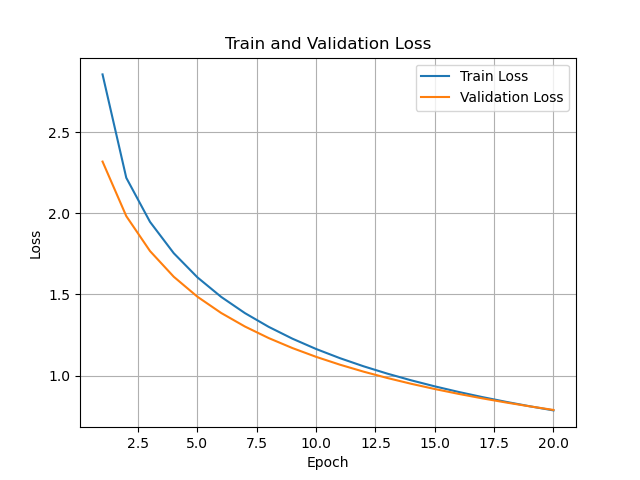

# SimCLR
PyTorch implementation of SimCLR: A Simple Framework for Contrastive Learning of Visual Representations by T. Chen et al.
Including support for:
- Distributed data parallel training
- Global batch normalization

[Link to paper](https://arxiv.org/pdf/2002.05709.pdf)

### Setup
Clone this repository, then create a conda virtual environment using the `requirement.txt` file:
```
$ cd SimCLR
$ conda create --name <env> --file requirement.txt
```

### Load pre-trained model
This downloads a model pretrained on STL-10 datset for 100 epoch with resnet 18 backbone
(resnet18 was chosen instead of resnet50 because of the computing constraint I had and the small amount of training data)
```
wget https://github.com/Spijkervet/SimCLR/releases/download/1.1/checkpoint_100.tar -O checkpoint_100.tar
```
The feature dimension for after the CNN is 512. 

### Hyperparameter tuning
The following parameters can be modified in `config.yaml`: 
```
projection_dim: 64 
optimizer: "Adam" 
weight_decay: 1.0e-6 
temperature: 0.5
```
According to the original paper, temperature = 0.5 is optimal for small batch sizes. (Here batch size is 32 because of computation constraints)

### Curate dataset
The dataset is downloaded using the CocoDetection format. To convert a detection dataset into a classification dataset, use the following script to crop each object based on its 
annotated bounding box and memorize the category label in the image file name. 
```
python curate_dataset.py
```

### Fine-tune linear classifier
```
python linear_evaluation.py --model_path=. --epoch_num=100 --resnet=resnet18 --logistic_batch_size=32
```
The console outputs are the following: 
```
n_features:  512
simclr n_features:  512
### Creating features from pre-trained context model ###
Step [0/82]      Computing features...
Step [20/82]     Computing features...
Step [40/82]     Computing features...
Step [60/82]     Computing features...
Step [80/82]     Computing features...
Features shape (2606, 512)
Step [0/14]      Computing features...
Features shape (424, 512)
Step [0/24]      Computing features...
Step [20/24]     Computing features...
Features shape (755, 512)
Epoch [0/20]     Loss: 2.8559039380492233        Accuracy: 0.31827090592334495
Epoch [1/20]     Loss: 2.2186023011440184        Accuracy: 0.44272648083623695
Epoch [2/20]     Loss: 1.9469848754929333        Accuracy: 0.5147539198606272
Epoch [3/20]     Loss: 1.7538633637311982        Accuracy: 0.5644054878048781
Epoch [4/20]     Loss: 1.6046792414130233        Accuracy: 0.5960365853658537
Epoch [5/20]     Loss: 1.4843639338888772        Accuracy: 0.6288109756097561
Epoch [6/20]     Loss: 1.384534775483899         Accuracy: 0.6517857142857143
Epoch [7/20]     Loss: 1.2999341066290693        Accuracy: 0.6719838850174216
Epoch [8/20]     Loss: 1.2270252595587474        Accuracy: 0.6968641114982579
Epoch [9/20]     Loss: 1.1633222357528965        Accuracy: 0.7109647212543554
Epoch [10/20]    Loss: 1.1070195051228129        Accuracy: 0.7251742160278746
Epoch [11/20]    Loss: 1.0567693906586344        Accuracy: 0.7343205574912892
Epoch [12/20]    Loss: 1.011542294810458         Accuracy: 0.7488022648083624
Epoch [13/20]    Loss: 0.9705363526576902        Accuracy: 0.7609973867595818
Epoch [14/20]    Loss: 0.9331168277961451        Accuracy: 0.7728114111498258
Epoch [15/20]    Loss: 0.8987745599048894        Accuracy: 0.7861498257839721
Epoch [16/20]    Loss: 0.8670963161602253        Accuracy: 0.7975827526132403
Epoch [17/20]    Loss: 0.8377431303989596        Accuracy: 0.8067290940766549
Epoch [18/20]    Loss: 0.8104344351989466        Accuracy: 0.8166376306620209
Epoch [19/20]    Loss: 0.7849359272456751        Accuracy: 0.8215918989547037
[FINAL]  Loss: 0.8388224414416722        Accuracy: 0.7901785714285714
train_losses:  [2.8559039380492233, 2.2186023011440184, 1.9469848754929333, 1.7538633637311982, 1.6046792414130233, 1.4843639338888772, 1.384534775483899, 1.2999341066290693, 1.2270252595587474, 1.1633222357528965, 1.1070195051228129, 1.0567693906586344, 1.011542294810458, 0.9705363526576902, 0.9331168277961451, 0.8987745599048894, 0.8670963161602253, 0.8377431303989596, 0.8104344351989466, 0.7849359272456751]
train_accuracies:  [0.31827090592334495, 0.44272648083623695, 0.5147539198606272, 0.5644054878048781, 0.5960365853658537, 0.6288109756097561, 0.6517857142857143, 0.6719838850174216, 0.6968641114982579, 0.7109647212543554, 0.7251742160278746, 0.7343205574912892, 0.7488022648083624, 0.7609973867595818, 0.7728114111498258, 0.7861498257839721, 0.7975827526132403, 0.8067290940766549, 0.8166376306620209, 0.8215918989547037]
validation_losses:  [2.3186200310786567, 1.9824271748463314, 1.767082115014394, 1.608788972099622, 1.4853242685397465, 1.3852847069501877, 1.3018858631451924, 1.2308073391517003, 1.1691753566265106, 1.1150002429882686, 1.0668518890937169, 1.023668922483921, 0.9846422597765923, 0.9491409758726755, 0.9166637137532234, 0.8868054648240408, 0.8592347676555315, 0.8336770633856455, 0.8099027300874392, 0.7877178688844045]
validation_accuracies:  [0.3907620614035088, 0.49280427631578944, 0.5648985745614036, 0.6035498903508772, 0.6269873903508772, 0.6517269736842105, 0.6764665570175438, 0.7003837719298246, 0.7108004385964913, 0.7273163377192983, 0.7468475877192983, 0.7585663377192983, 0.7663788377192983, 0.7789884868421053, 0.7881030701754387, 0.7946134868421053, 0.7998218201754387, 0.8085252192982456, 0.8150356359649122, 0.8150356359649122]
```

")

")




### Optional future experiments

#### Train/Finetune entire model
```
python main.py --dataset FDD
```


